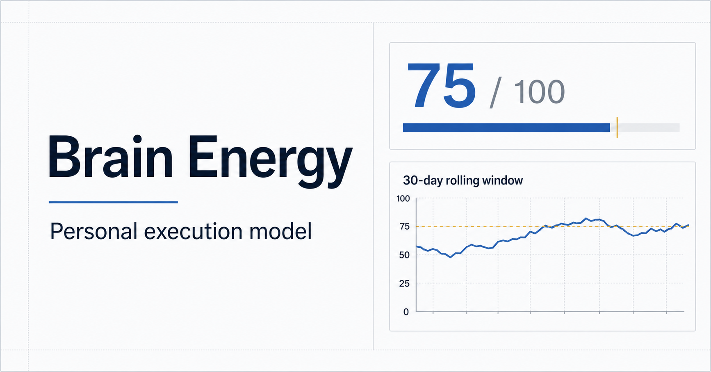

# Brain Energy

**A personal execution system that plans around energy, not just time.**

Most task managers assume that an open hour is a usable hour. Brain Energy starts from a different question: **how much mental capacity do I realistically have today, and which tasks fit inside it?**



## Why I built it

I often had more tasks than usable energy. A conventional to-do list could show everything I wanted to finish, but it could not explain why an apparently reasonable plan repeatedly failed.

Brain Energy turns daily state, task demand, and reflection into a practical feedback loop:

**Check in → estimate capacity → choose tasks → execute → reflect → learn from history**

This is an independent product project focused on product thinking, personal analytics, and AI-assisted development.

## What it does

- **Daily state check-in** using sleep duration and timing, physical energy, mood, stress, focus, and available time
- **Capacity estimate** that converts those inputs into a daily energy budget
- **Task library** with category, duration, energy cost, urgency, and optional deadlines
- **Today planning** that shows whether the selected workload fits both remaining energy and time
- **Idea Vault** that keeps ideas separate from commitments until the user intentionally promotes them
- **Execution tracking** for planned, started, completed, and skipped tasks
- **Evening reflection** that records remaining energy, exercise, outcomes, and the main reason work was unfinished
- **History and analysis** based only on genuine saved records
- **Personalization threshold** that waits for at least 10 eligible observations before treating the data as sufficient for a personal model
- **JSON backup and restore**
- **Chinese and English interface**
- **Authenticated cloud persistence** with per-user data separation

## Product decisions

### Energy and time are separate constraints

A task may fit into the calendar but still exceed the user's remaining cognitive capacity. Brain Energy evaluates both instead of treating available time as the only budget.

### Ideas are not automatically tasks

The Idea Vault reduces the pressure created when every interesting thought becomes an immediate commitment.

### Unfinished work needs context

An incomplete plan does not always mean low energy. The reflection distinguishes energy limits from insufficient time, changed priorities, and inaccurate estimates so future analysis does not learn the wrong lesson.

### Personalization should wait for evidence

The product begins with a transparent baseline heuristic. It collects complete morning-and-evening observations before a future personalized model is considered ready.

## Current model

The baseline capacity estimate combines:

- sleep duration
- bedtime and wake-time effects
- self-reported physical energy
- mood
- stress
- focus

Sleep clock times use circular features so times around midnight remain mathematically close. Capacity is currently a planning estimate, not a medical or clinical measurement.

## Tech stack

- Next.js and React
- TypeScript
- CloudBase authentication and relational data storage
- Supabase-compatible migration experiments
- Cloudflare/Vite deployment tooling
- Responsive custom CSS
- Node test coverage for rendered product states

## Run locally

### Requirements

- Node.js 22.13 or newer
- A CloudBase application and publishable access key

### Setup

```bash
git clone https://github.com/betty-tGM2/brain-energy-personal.git
cd brain-energy-personal
npm install
cp .env.example .env.local
npm run dev
```

Add your CloudBase publishable key to `.env.local`:

```env
NEXT_PUBLIC_CLOUDBASE_ACCESS_KEY=your-publishable-key
```

Build and test:

```bash
npm run build
npm test
```

## Privacy

User records are stored per authenticated user. The repository contains no production credentials; configuration values must be supplied through environment variables.

Because the app records personal wellbeing and productivity signals, it is designed as a self-reflection tool—not a medical device or diagnostic system.

## Project status

Brain Energy is a working product prototype under active iteration. The current version validates the end-to-end experience and data model. Future work includes evaluating the personalized model with sufficient longitudinal data, improving insights, and reducing check-in friction.

## What this project demonstrates

- Translating an everyday problem into a structured product system
- Designing a full behavioral feedback loop rather than a single feature
- Combining product design, data modeling, and statistical thinking
- Building authentication, persistence, responsive UI, and bilingual UX
- Using user feedback to identify privacy, customization, and input-friction risks

---

Built by [Betty Liu](https://github.com/betty-tGM2).
